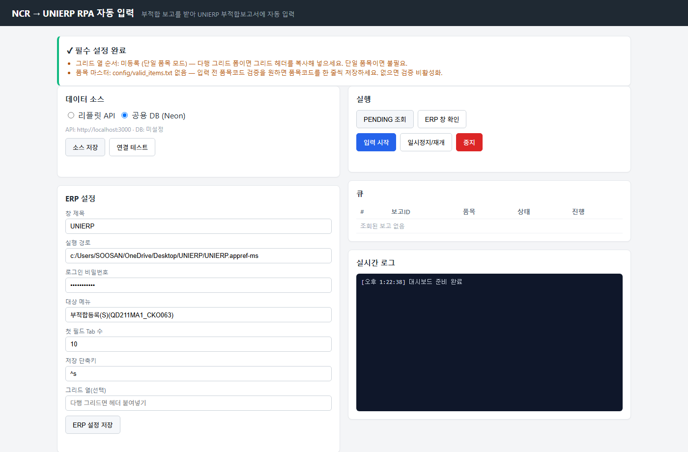
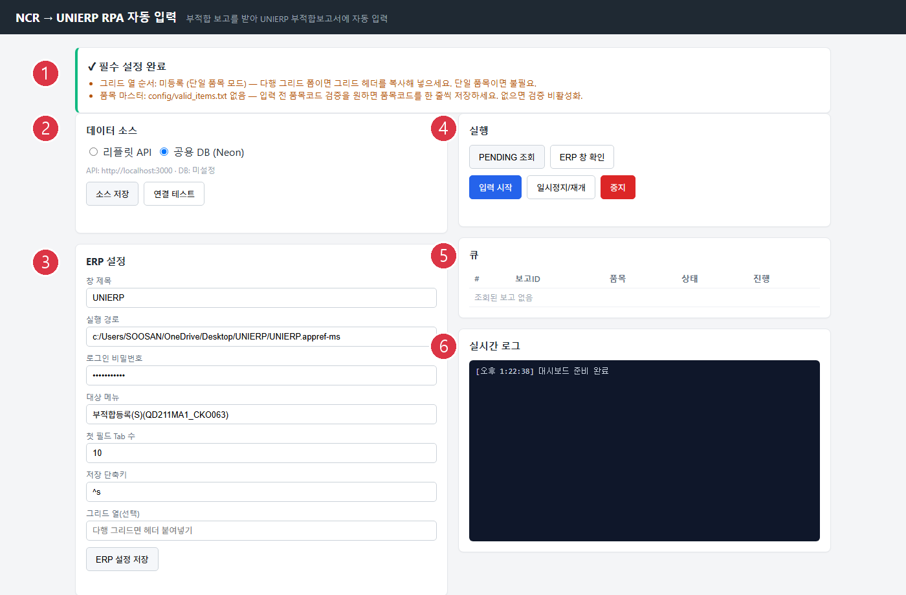
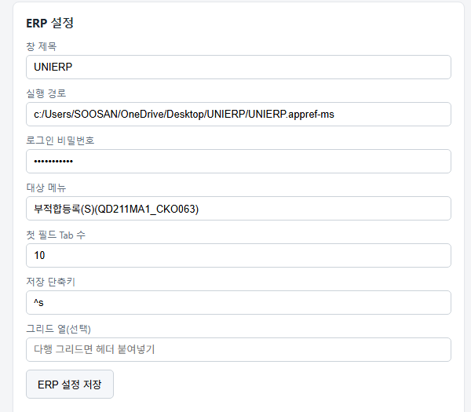
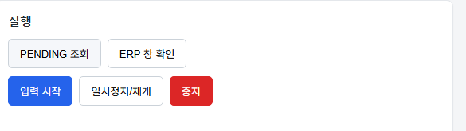
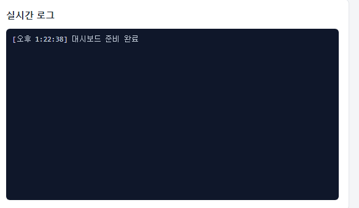

<!--
title: RPA 사용 상세 가이드
role: operator
subtitle: 대시보드 · 검토 워크플로 · 예외 상황 (2026-07 T1/T2 반영)
-->

<div class="doc-header">
UNIERP 자동입력을 <strong>일상 운영</strong> 하는 데 필요한 상세. T1(자동회수)·T2(REVIEW 영속화) 반영.
</div>

## 1. 프로그램 시작

- 바탕화면 **NCR RPA** 아이콘 더블클릭
- 처음이면 UAC 창 뜸 → **[예]**
- 검은 콘솔 창 뜨고 → 브라우저가 `http://127.0.0.1:8010` 자동 오픈

<figure>

<figcaption>첫 실행 시 브라우저 자동 오픈되는 대시보드</figcaption>
</figure>

<blockquote class="warn">
[!warn] <strong>콘솔 창을 닫으면 서버 종료</strong>. 최소화만 OK. 브라우저만 닫아도 서버는 살아있음.
</blockquote>

## 2. 대시보드 6개 섹션

<figure>

<figcaption>대시보드 전체 — 6개 섹션 번호 표시</figcaption>
</figure>

| # | 섹션 | 역할 |
|:-:|---|---|
| ① | 설정 점검 배너 | 필수 설정 누락 시 빨간 경고, 정상이면 ✓ |
| ② | 데이터 소스 | 리플릿 API / Neon DB 중 어디서 조회할지 (기본 **공용 DB**) |
| ③ | ERP 설정 | UNIERP 창 제목·실행경로·로그인PW 등 |
| ④ | 실행 | PENDING 조회 / ERP 창 확인 / 입력·일시정지·중지 |
| ⑤ | 큐 | 처리할 보고 목록과 상태 |
| ⑥ | 실시간 로그 | RPA 진행 라이브 출력 |

### 2.1 ERP 설정 (③)

<figure>

<figcaption>③ ERP 설정 섹션 — 창 제목·경로·비밀번호</figcaption>
</figure>

| 항목 | 값 |
|---|---|
| 창 제목 | `UNIERP - SOOSAN CEBOTICS` (고정) |
| 실행 경로 | UNIERP 바로가기 경로 (예: `c:/Users/<계정>/OneDrive/Desktop/UNIERP/UNIERP.appref-ms`) |
| 로그인 비밀번호 | ERP 비밀번호 (비워두면 본인 로그인) |
| 대상 메뉴 | `부적합등록(S)(QD211MA1_CKO063)` (고정) |
| 첫 필드 Tab 수 | `10` |
| 저장 단축키 | `^s` (Ctrl+S) |

<blockquote class="info">
[!info] 필드 좌표는 <strong>[좌표 편집]</strong> UI 로 수정 가능 (<code>/api/field-mapping</code>).
저장은 원자적 (임시 파일 → rename) 이라 도중 크래시해도 원본 파일은 안 깨집니다.
</blockquote>

### 2.2 실행 (④) 버튼 5개

<figure>

<figcaption>④ 실행 섹션 — 조회·확인·시작·정지·중지 5개 버튼</figcaption>
</figure>

| 버튼 | 동작 |
|---|---|
| [PENDING 조회] | DB 에서 <span class="tag tag-pending">PENDING</span> 보고를 조회 |
| [ERP 창 확인] | UNIERP 창 감지. 없으면 자동 실행 시도 |
| **[입력 시작]** | 큐 보고를 하나씩 UNIERP 폼에 자동 입력 |
| [일시정지/재개] | 다음 키 전 대기. 다시 누르면 재개 |
| [중지] | 즉시 중단. 처리 중이던 보고는 <span class="tag tag-pending">PENDING</span> 복원 |

## 3. 일상 사용 4단계

### Step 1: UNIERP 준비
1. UNIERP 실행 + 로그인
2. F3 (메뉴찾기) → `부적합등록(S)` 검색해 폼 한 번 띄워둠
   *(이미 열려있으면 그대로 사용)*

### Step 2: PENDING 조회
1. **[PENDING 조회]** → 큐 채움
2. 0건이면 신규 보고 없음 → 종료해도 됨

<figure>

<figcaption>⑤ 큐 — 조회된 보고 목록과 각 상태</figcaption>
</figure>

<figure>

<figcaption>⑥ 실시간 로그 — 워커가 한 줄씩 진행 상황 출력</figcaption>
</figure>

<blockquote class="info">
[!info] 이 시점에 <strong>T1 자동회수</strong> 가 함께 실행됩니다. 이전 세션에서 크래시로
<span class="tag tag-processing">PROCESSING</span> 상태로 갇힌 보고 (5시간 이상)는 자동으로
<span class="tag tag-pending">PENDING</span> 로 복원되어 큐에 포함됩니다.
</blockquote>

### Step 3: 입력 시작
1. **[ERP 창 확인]** → "메인 창 찾음" 메시지
2. **[입력 시작]**
3. **자리 비우고 대기** (건당 30~60초)

<blockquote class="warn">
[!warn] <strong>RPA 도는 중 절대 금지</strong>: 마우스·키보드 입력, 창 전환, 채팅·메일 확인.
포커스 이탈 감지되면 자동 중지되고 그 보고는 <span class="tag tag-failed">FAILED</span> 마킹.
</blockquote>

### Step 4: 검토 → 완료 확인

각 보고 입력·저장 끝나면 자동으로 다음이 일어남:

1. 큐 상태 = "저장됨" (검토 대기)
2. **DB 상태 = <span class="tag tag-review">REVIEW</span>** *(신규, T2)*
3. 워커는 다음 보고로 진행

모든 보고 끝나면 **검토 패널** 이 열림 → 각 보고 UNIERP 화면과 대조 → **[완료 확인]** 또는 **[모두 확인]**

## 4. T2 REVIEW 상태 상세

### 4.1 왜 REVIEW 인가?

이전 시스템 문제:
- UNIERP 저장은 됐는데 사용자 확인 대기 큐가 **서버 메모리에만** 존재
- 브라우저 닫음 · PC 재부팅 · 콘솔 종료 → 큐 사라짐
- 다시 조회하면 DB 는 <span class="tag tag-processing">PROCESSING</span> 로 남아 → **UNIERP 이중입력** 위험

### 4.2 REVIEW 도입 후

- UNIERP 저장 직후 DB 승격 → 서버·워커 재시작해도 상태 유지
- <span class="tag tag-review">REVIEW</span> 상태 보고는 **다음 [PENDING 조회] 에 포함되지 않음** → 자동 이중입력 방지
- 대시보드 다시 열면 자동으로 **이전 REVIEW 보고들 복원**되어 검토 패널에 표시

### 4.3 REVIEW 복원 확인 방법

브라우저에서 **대시보드 첫 화면** 진입 시:
- 이전 세션의 REVIEW 보고가 있으면 자동으로 검토 패널이 뜸
- 각 보고에 **[복원됨]** 배지 표시 (아이콘 앞)
- 확인 흐름은 신규 REVIEW 와 동일 → **[완료 확인]**

## 5. T1 자동회수 상세

### 5.1 시나리오
- RPA 워커 크래시 (콘솔 강제 종료 등)
- 네트워크 단절
- 위 두 경우 보고가 <span class="tag tag-processing">PROCESSING</span> 로 갇힘

### 5.2 자동 복구
- **임계값 5시간** (관리자가 env 로 조절 가능: `RPA_STALE_PROCESSING_MINUTES`)
- 다음 [PENDING 조회] 시 자동으로 <span class="tag tag-pending">PENDING</span> 복원
- `sync_last_error` 컬럼에 `[auto-recovered] PROCESSING > 300분 경과...` 기록
- `sync_attempt_count` 증가

### 5.3 운영자가 알아둘 것
- 이제 갇힌 보고를 **손으로 DB 조작할 필요 없음**
- 로그에서 `[reports/pending] stale PROCESSING 자동 복원: 3건 → PENDING` 같은 메시지 확인
- 5시간 안에 자동 회복되므로 일반 운영엔 영향 없음

## 6. 중지·일시정지

### 6.1 일시정지
- 다음 필드 입력 전에 멈춤
- UNIERP 창을 조작할 수 있는 상태
- **[재개]** 눌러 계속

### 6.2 중지
- 즉시 워커 종료
- 처리 중이던 보고: <span class="tag tag-pending">PENDING</span> 복원 (재시도 카운트 초기화)
- 이미 저장된 <span class="tag tag-review">REVIEW</span> 보고들: 그대로 유지 (다음 세션에 복원)

## 7. 필드 좌표 캘리브레이션 (문제 발생 시)

**증상**: RPA 가 UNIERP 폼의 잘못된 위치에 클릭·타이핑

**원인**: PC 해상도·모니터 배치가 캘리브 기준(1920×1080)과 다름

**대응**:
1. 대시보드에서 **[필드 좌표 편집]** UI 진입
2. 각 필드의 `ref_x`, `ref_y` 를 UNIERP 화면 실제 좌표로 조정
3. **[저장]** → `field_mapping.json` 원자적 업데이트 (실패해도 원본 안 깨짐)

<blockquote class="info">
[!info] 좌표는 0~20000 범위여야 함. 그 외 값 입력하면 <code>422</code> 오류 반환. UI 가 안내함.
</blockquote>

## 8. 트러블슈팅

| 증상 | 원인 · 대응 |
|---|---|
| "UNIERP 창을 찾을 수 없습니다" | 창 켜져 있는지 확인. 최소화도 안 됨. `[ERP 창 확인]` 재클릭 |
| 로그인 창에서 멈춤 | ③번 섹션에 비밀번호 확인. 저장 후 재시도 |
| 필드 잘못된 위치 클릭 | 캘리브레이션 (7절) |
| 팝업 뜨고 진행 안 됨 | RPA 가 팝업 감지 → 자동 일시정지. UNIERP 확인 후 [재개] |
| <span class="tag tag-review">REVIEW</span> 보고가 계속 남음 | 검토 패널에서 [완료 확인] 눌러야 <span class="tag tag-completed">COMPLETED</span> |
| 관리자 권한 부족 오류 | `시작.bat` 을 우클릭 → "관리자 권한으로 실행" |
| 콘솔 창에 한글 깨짐 | `PYTHONIOENCODING=utf-8` 이 시작.bat 에 이미 반영됨. Windows 코드페이지 확인 |
| 여러 보고가 <span class="tag tag-failed">FAILED</span> 로 마킹 | UNIERP 상태·좌표 문제. logs/*.log 최신 확인 |

## 9. 로그 위치

```
rpa-ncr/logs/
├── rpa_ncr_YYYY-MM-DD.log     ← 오늘 실행 로그
├── rpa_ncr_YYYY-MM-DD.log.1   ← 어제 (roll)
├── ...
```

문제 발생 시 최신 파일 확인. 5개까지 자동 회전.

## 10. 언제 종료해야 하나?

- 큐에 처리할 보고 없음 (`PENDING 조회` 결과 0건)
- **REVIEW 남아 있어도 종료 OK** — 다음 세션에 복원됨
- 콘솔 창 닫기 → 서버 종료

## 11. 자주 하는 질문

**Q. 도중에 UNIERP 를 다른 사람이 클릭하면?**
A. 포커스 워치독 감지 → 자동 중지. 그 보고는 <span class="tag tag-failed">FAILED</span>. 다른 사람이 사용 안 하는 시간에 실행 권장.

**Q. 검토 패널 없이 즉시 COMPLETED 로 하고 싶다.**
A. 현재 지원 안 함. UNIERP 실 저장 검증 위해 검토 필수.

**Q. 필드 좌표 바꿨는데 새 좌표가 안 반영됨.**
A. 저장 후 페이지 새로고침. 그래도 안 되면 rpa-ncr 재시작.

**Q. 여러 PC 에서 동시에 실행 가능?**
A. 안 됨. 같은 DB 를 여러 워커가 조회하면 이중입력 위험.

**Q. 밤새 자동으로 돌리고 싶다.**
A. 현재 지원 안 함. UNIERP 세션이 밤새 유지 안 되고, 검토도 사람이 확인해야 함.
