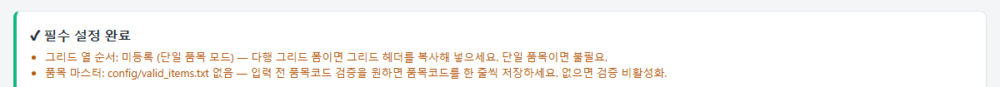
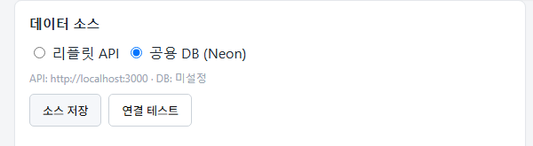

<!--
title: RPA 설치 상세 가이드
role: operator
subtitle: 백승기 직장님 PC 최초 설치 · 2회차 이후 갱신
-->

<div class="doc-header">
UNIERP 가 설치된 PC 에서 <strong>rpa-ncr 워커를 실행할 수 있게 세팅</strong> 하는 과정.
한 번만 하면 되고, 이후에는 <code>git pull</code> 정도만 하면 됩니다.
</div>

## A. 사전 설치 프로그램

아래 순서대로 설치.

| # | 프로그램 | 용도 | 다운로드 |
|:-:|---|---|---|
| 1 | **Git for Windows** | 코드 클론·업데이트 | [git-scm.com/download/win](https://git-scm.com/download/win) |
| 2 | **Python 3.11 또는 3.12** *(필수)* | RPA 실행 환경 | [python.org/downloads/windows](https://www.python.org/downloads/windows/) |
| 3 | **크롬 or 엣지** | 대시보드 브라우저 | 기본값 |

<blockquote class="warn">
[!warn] Python 설치 시 <strong>"Add Python to PATH"</strong> 체크박스 꼭 켜세요.
설치 후 <code>python --version</code> 이 콘솔에서 잘 나오는지 확인.
</blockquote>

## B. 코드 받기

```powershell
cd C:\Users\Administrator\Downloads
git clone https://github.com/Zel-da/Code-Transformer.git
cd Code-Transformer\rpa-ncr
```

## C. PRIVATE 폴더 세팅

`PRIVATE/app_db.json` 파일을 담당자에게 받아 아래 위치에 저장:

```
Code-Transformer/
├── PRIVATE/
│   └── app_db.json      ← 담당자에게 받아 여기
├── rpa-ncr/
```

<blockquote class="warn">
[!warn] <code>PRIVATE</code> 폴더는 <code>.gitignore</code> 되어 있어 git 에 안 올라갑니다.
비밀번호가 담긴 파일이므로 <strong>공유 폴더·이메일·채팅 등에 올리지 마세요</strong>.
USB 로 전달 권장.
</blockquote>

## D. 원클릭 실행 (첫 실행 시 자동 설치됨)

`rpa-ncr\시작.bat` 를 **더블클릭**하면 다음이 자동으로 됨:

1. **관리자 권한 승격** (UAC 창 → [예])
2. Python 설치 확인
3. `.venv` 가상환경 생성
4. `requirements.txt` 자동 설치 *(2~3분)*
5. 설치 성공 표시 `.venv/.install_ok` 마커 생성
6. `main.py` 실행 → 브라우저 자동 열림

<blockquote class="info">
[!info] <strong>왜 관리자 권한이 필요한가?</strong>
UNIERP 가 관리자로 실행되면 Windows UIPI 제약 때문에 일반 프로세스는
UNIERP 창을 조작할 수 없습니다. RPA 워커도 관리자여야 UIA 로 UNIERP 를 제어할 수 있어요.
</blockquote>

<blockquote class="warn">
[!warn] <strong>설치 실패 시</strong>: 인터넷 연결 확인 후 다시 실행. <code>.install_ok</code> 마커는
성공했을 때만 만들어지므로 반쪽 상태 걱정 없이 다시 눌러도 됩니다.
</blockquote>

## E. 바탕화면 바로가기 만들기 (1회)

`rpa-ncr\바탕화면에 바로가기 만들기.bat` 를 **1회** 더블클릭 → 다음부터는 바탕화면 아이콘으로 실행.

## F. 첫 실행 후 확인

브라우저에서 `http://127.0.0.1:8010` 이 자동 열리면:

1. 상단 **설정 점검 배너** → 초록 ✓ 있으면 정상

<figure>

<figcaption>① 설정 점검 배너 — 필수 값 모두 정상이면 초록 ✓</figcaption>
</figure>

2. **데이터 소스 → [연결 테스트]** → "DB 연결 OK (Neon)" 확인

<figure>

<figcaption>② 데이터 소스 섹션 — 기본 "공용 DB (Neon)"</figcaption>
</figure>

3. **ERP 설정** 값들이 예상대로 채워져 있는지 확인 (창 제목·실행 경로 등)

## G. 코드 업데이트 (2회차 이후)

새 기능이 나오면:

```powershell
cd C:\Users\Administrator\Downloads\Code-Transformer
git pull
```

그다음 `시작.bat` 을 다시 실행. `requirements.txt` 가 바뀌었으면:

```powershell
cd rpa-ncr
del .venv\.install_ok
```

로 마커를 지우면 다음 실행에서 자동 재설치됨.

## H. 문제 진단

`rpa-ncr\진단.bat` 를 실행하면 다음을 자동 확인:
- Python 버전
- venv 상태
- 필수 패키지 설치 여부
- Neon DB 연결
- UNIERP 창 감지 여부

<blockquote class="info">
[!info] 진단 결과를 캡처해서 IT 관리자에게 보내면 원인 파악이 빨라집니다.
</blockquote>

## I. 흔한 설치 오류

| 증상 | 원인 | 해결 |
|---|---|---|
| `python --version` 오류 | PATH 미등록 | 재설치 시 "Add Python to PATH" 체크 |
| `pip install` 도중 실패 | 회사 프록시·사내망 방화벽 | IT 팀 문의, `pip config` 프록시 설정 |
| 브라우저 안 열림 | 포트 8010 사용 중 | 콘솔 로그에 "포트 8011 사용" 등 표시 → 그 주소로 접속 |
| UAC 승격 후 창 즉시 꺼짐 | 백신·EDR 차단 | IT 팀에 예외 등록 요청 |
| `PRIVATE/app_db.json 없음` 경고 | 파일 미배치 | C-D 단계 참고 |
| ERP 설정 저장 실패 | 관리자 권한 아님 | 시작.bat 을 반드시 UAC 승격 경로로 실행 |

## J. 관련 파일

| 경로 | 역할 |
|---|---|
| `rpa-ncr/시작.bat` | 원클릭 실행 (UAC 승격 + 자동 설치 + 실행) |
| `rpa-ncr/바탕화면에 바로가기 만들기.bat` | 1회용 |
| `rpa-ncr/진단.bat` | 문제 진단 |
| `rpa-ncr/config/settings.json` | 대부분 설정 (UI 로도 편집 가능) |
| `rpa-ncr/config/field_mapping.json` | 필드 좌표 매핑 (UI 로 편집) |
| `rpa-ncr/logs/*.log` | 실행 로그 (문제 발생 시 최신 파일 확인) |
| `PRIVATE/app_db.json` | Neon DB 접속 (gitignore) |
