<!--
title: 처음부터 끝까지 따라하기
role: operator
subtitle: 설치 → 매일 사용 → 업데이트 → 트러블슈팅. 스크린샷으로 보는 완전 가이드.
-->

<div class="doc-header">
이 문서는 <strong>RPA 를 처음 쓰는 사람</strong> 이 보고 그대로 따라만 하면 끝까지 돌릴 수 있도록
만든 매뉴얼입니다. 전제 지식 없음, 각 단계마다 <strong>지금 화면에 뭐가 보여야 하는지</strong> 와
<strong>뭘 눌러야 하는지</strong> 를 그림과 함께 설명합니다.
</div>

## 이 프로그램이 하는 일 (30초 요약)

웹페이지에 등록된 **부적합 보고(NCR)** 를 `부적합판정등록(S)` UNIERP 메뉴에 **자동으로 입력** 합니다. 사람은 **[입력 시작]** 버튼만 누르면 되고, RPA 가 Tab 키를 눌러가며 25개 필드를 전부 채워넣고 저장까지 합니다. 입력 끝나면 사람이 결과를 **눈으로 한 번 확인하고 [완료 확인]** 만 눌러주면 끝.

<figure>
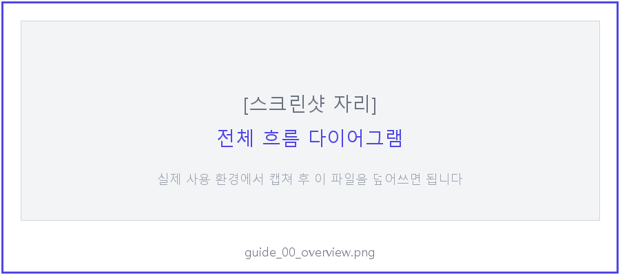
<figcaption>[스크린샷 자리] 전체 흐름 — 웹 등록 → QC 승인 → RPA 자동입력 → 확인 → 완료</figcaption>
</figure>

---

## 1부. 처음 설치 (최초 1회만)

### 1-1. Python 설치 확인

**해야 할 것**:
- 윈도우 키 → `cmd` → **Enter**
- 검정 창에서 `python --version` 입력 → **Enter**

**정상 결과**: `Python 3.11.x` 또는 `Python 3.12.x` 가 나오면 OK.

**없거나 오류**: [python.org](https://www.python.org/downloads/windows/) 에서 다운로드 → 설치 중 **"Add Python to PATH"** 체크박스 반드시 체크.

> [!warn] **Python 3.13 은 사용 금지** — 일부 패키지(Jinja2 등) 호환 문제. 3.11 또는 3.12 설치할 것.

### 1-2. 프로그램 다운로드

브라우저에서 아래 주소 접속:

```
https://github.com/Zel-da/Code-Transformer/archive/refs/heads/main.zip
```

`Code-Transformer-main.zip` 이 다운로드 됩니다. 압축을 풀면 안에 여러 폴더가 있는데, 그 중 **`rpa-ncr/`** 폴더만 필요합니다.

**해야 할 것**:
1. zip 압축 풀기
2. 안에 있는 **`rpa-ncr/` 폴더 통째로** 복사해서 `C:\Users\<내 계정>\Documents\` 아래로 이동
3. 결과: `C:\Users\<내 계정>\Documents\rpa-ncr\` 에 `시작.bat`, `main.py`, `src/`, `config/`, `docs/` 등이 보여야 함

<figure>
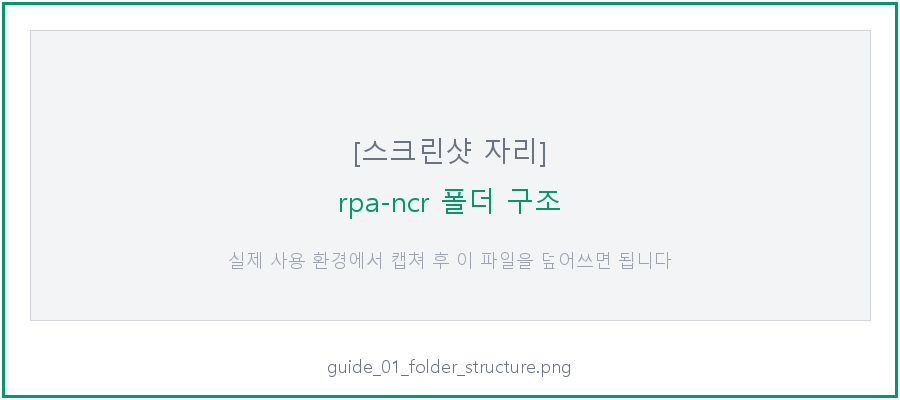
<figcaption>[스크린샷 자리] Documents\rpa-ncr 폴더 안 구조 — 시작.bat 이 보여야 정상</figcaption>
</figure>

### 1-3. PRIVATE/app_db.json 넣기 (중요)

이 파일은 **DB 접속 정보**가 들어있어서 깃에 올라가지 않습니다. **IT 담당자(안예준)에게 USB 로 받아서** 넣어야 합니다.

**해야 할 것**:
1. `Documents\rpa-ncr\` 안에 **`PRIVATE`** 폴더 만들기 (대문자 주의)
2. 받은 `app_db.json` 파일을 **`PRIVATE` 폴더 안**에 복사
3. 최종 경로: `Documents\rpa-ncr\PRIVATE\app_db.json`

<figure>
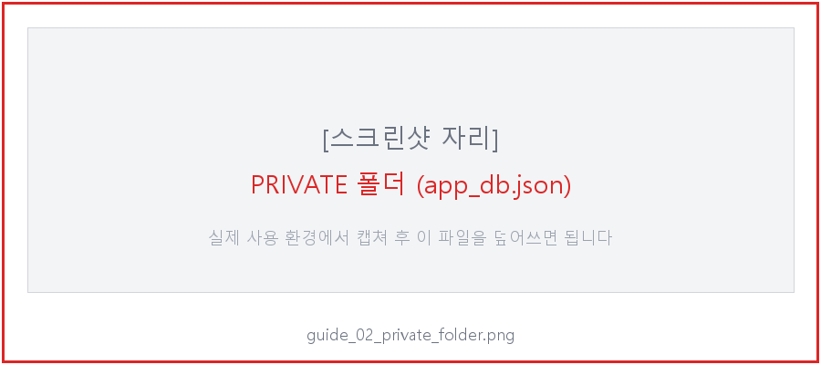
<figcaption>[스크린샷 자리] PRIVATE 폴더 안에 app_db.json 하나 있는 모습</figcaption>
</figure>

> [!warn] **PRIVATE 폴더는 절대 외부에 공유하거나 깃에 올리면 안 됩니다.** DB 비밀번호가 노출됩니다.

### 1-4. 바탕화면 바로가기 만들기 (선택)

**해야 할 것**:
1. `Documents\rpa-ncr\바탕화면에 바로가기 만들기.bat` 더블클릭
2. 바탕화면에 **`NCR RPA`** 아이콘이 생김 → 이걸 더블클릭하면 다음부터는 시작.bat 안 찾아도 됨

---

## 2부. 매일 사용하는 법

### 2-1. UNIERP 미리 실행

RPA 가 UNIERP 창에 입력하려면 **UNIERP 가 먼저 떠있어야** 합니다.

**해야 할 것**:
1. UNIERP 바로가기를 **"관리자 권한으로 실행"** 우클릭 (중요)
2. 로그인 완료
3. 메뉴는 아무거나 열어둬도 되고 안 열어도 됨 — RPA 가 알아서 메뉴 열고 판정등록으로 들어감

> [!info] **왜 관리자 권한?** UNIERP 가 관리자로 뜨면 RPA 도 관리자여야 창 조작 가능 (Windows 보안 정책). 아래 시작.bat 이 자동으로 관리자 승격 요청합니다.

### 2-2. 시작.bat 더블클릭

바탕화면 **`NCR RPA`** 아이콘 또는 `Documents\rpa-ncr\시작.bat` 더블클릭.

**정상 흐름**:
1. **UAC 창** 뜨면 **[예]** 클릭 (관리자 승격)
2. 검정 CMD 창이 열리고 다음 메시지가 순서대로 뜸:
   - `[first run] initial update check...` (첫 실행 때만)
   - `.venv` 설치 (첫 실행 때 2~3분, 이후엔 즉시 패스)
   - `main.py` 실행 → 브라우저가 **자동으로 열림** (`http://127.0.0.1:8010`)

<figure>
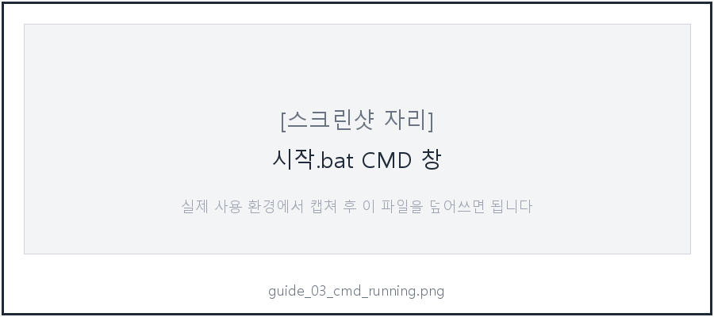
<figcaption>[스크린샷 자리] 시작.bat 실행 중 CMD 창 — 마지막에 "Uvicorn running" 메시지가 뜨면 정상</figcaption>
</figure>

### 2-3. 대시보드 둘러보기 — 상단 상태바

브라우저가 자동으로 열리고 **대시보드** 가 뜹니다. 먼저 **상단바** 를 봅시다:

<figure>
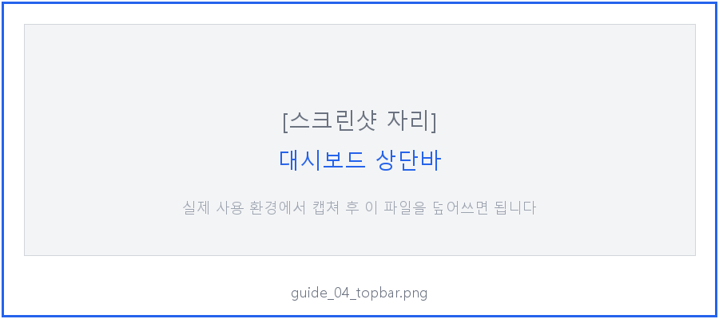
<figcaption>[스크린샷 자리] 상단바 — 왼쪽 "NCR UNIERP 자동 입력" 로고 + 가운데 chip 3개 + 오른쪽 설정 버튼</figcaption>
</figure>

**가운데 chip 3개**:
- `소스: DB (Neon)` — 어느 데이터 소스에 연결됐는지 (DB 가 기본)
- `ERP 미연결` → **[ERP 창 확인]** 눌러서 UNIERP 창 발견되면 `ERP 연결됨` 으로 바뀜
- `큐 비어있음` → **[PENDING 조회]** 누르면 `큐 N/M 완료` 로 바뀜

**우측 버튼**:
- `📥 새 업데이트` **노란 깜빡이** 배지 — 업데이트 있을 때만 뜸 (없으면 안 뜸)
- `⚙ 설정` — 소스/ERP 설정 drawer 를 열고 닫음 (평상시 안 봄)

### 2-4. [PENDING 조회] 클릭

본문 가장 위 **실행 바** 에서 **[📥 PENDING 조회]** 버튼 클릭.

<figure>
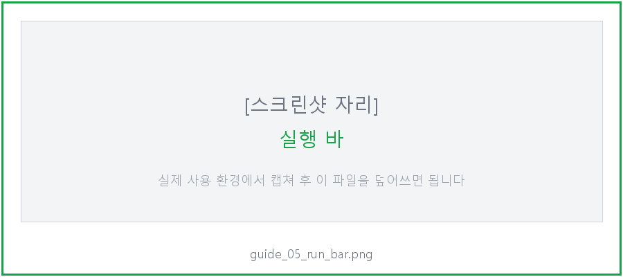
<figcaption>[스크린샷 자리] 실행 바 — PENDING 조회, ERP 창 확인 (왼쪽) / 입력 시작, 일시정지, 중지 (오른쪽)</figcaption>
</figure>

**정상 결과**:
- 하단 **큐 테이블** 에 QC 승인 완료된 보고 목록이 뜸
- 상단 chip 이 `큐 0/N 완료` 로 바뀜
- 로그에 `PENDING 보고 N건 조회됨` 메시지

**0건 나오면**: QC 담당자가 아직 승인 안 한 상태. 웹에서 QC 승인 받은 보고만 이 큐에 뜸.

### 2-5. 큐 테이블 읽는 법

<figure>
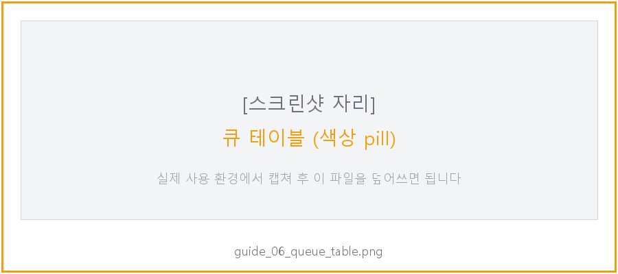
<figcaption>[스크린샷 자리] 큐 테이블 — 각 보고의 상태가 색상 pill 로 표시</figcaption>
</figure>

| 열 | 의미 |
|---|---|
| `#` | 큐 안 순서 (1부터) |
| `ID` | DB 상의 보고 번호 |
| `NCR 번호` | NCR-25-xxxx 같은 사람이 보는 번호 |
| `품목코드` | CL411xxxx 같은 품목 코드 |
| `QC` | QC 승인 상태 (초록 "승인" 이어야 입력 대상) |
| `진행` | 현재 작업 상태 (아래 색상 참고) |
| `재시도` | 실패 재시도 횟수 (↻ N) — 평상시 "-" |

**진행 열 색상**:
- <span class="tag tag-pending">대기</span> 회색 — 아직 입력 안 함
- <span class="tag tag-processing">입력중</span> 파랑 — RPA 가 지금 ERP 에 타이핑 중
- <span class="tag tag-review">저장됨</span> 노랑 — ERP 저장 완료, 사용자 검토 대기
- <span class="tag tag-completed">완료</span> 초록 — [완료 확인] 눌러서 끝
- <span class="tag tag-failed">실패</span> 빨강 — 5회 재시도 모두 실패, 수동 조치 필요

### 2-6. [ERP 창 확인]

**해야 할 것**: 실행 바에서 **[🔍 ERP 창 확인]** 클릭.

**정상 결과**:
- 상단 chip 이 `ERP 연결됨` (초록) 으로 바뀜
- 로그: `✓ ERP 창 발견: UNIERP - SOOSAN CEBOTICS(Admin)`

**"ERP 미연결" 나오면**:
- UNIERP 가 안 떠있거나, 관리자 권한으로 안 떠있는 상태
- UNIERP 창 켜고 다시 **[🔍 ERP 창 확인]** 눌러보기

### 2-7. [▶ 입력 시작]

여기부터는 **RPA 가 ERP 를 직접 조작** 합니다. 조작 중에는 **마우스/키보드 건드리지 말 것** (포커스가 이탈하면 중단됨).

**해야 할 것**:
1. UNIERP 창을 최상위로 올려놓음 (최소화 해제, 화면 가득 차게)
2. 대시보드에서 **[▶ 입력 시작]** 클릭

**정상 흐름** (큐에 10건이 있다고 가정):
1. RPA 가 `F3` 눌러서 메뉴 검색창 열기
2. `부적합판정등록(S)(QD231MA1_CKO063)` 복붙 + Enter
3. 판정등록 폼 뜨면 **Tab 10번** 누르고 발행팀 입력
4. 그 다음 Tab 치며 25개 필드 순서대로 입력
5. **Ctrl+S** 로 저장 → **Shift+Insert** 로 새 폼 열기
6. 다음 보고 반복 (총 10회)
7. 전부 끝나면 하단에 **배치 검토 패널** 이 노란색으로 열림

<figure>
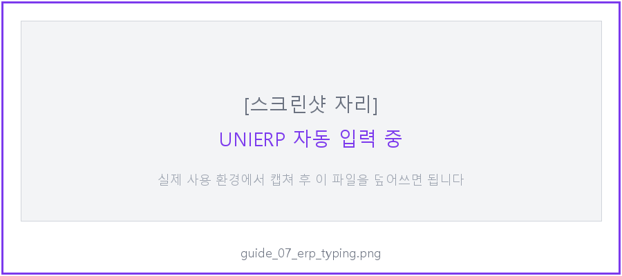
<figcaption>[스크린샷 자리] UNIERP 판정등록 폼에 RPA 가 Tab 으로 필드를 채워가는 모습</figcaption>
</figure>

**로그에 뜨는 메시지**:
- `[부적합판정등록] 입력 중: 보고 #123`
- `✓ #123 [부적합판정등록] 입력+저장 완료`
- 마지막에: `⏸ 전체 10건 입력 완료. 검토 패널에서 페이지별로 확인 후 [완료 확인]`

### 2-8. 배치 검토 UI

전체 입력이 끝나면 자동으로 **배치 검토 패널** (노란 테두리) 이 열립니다.

<figure>
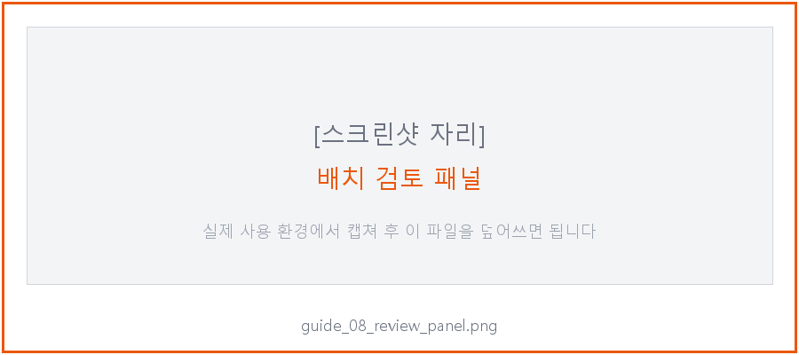
<figcaption>[스크린샷 자리] 배치 검토 패널 — 보고 1개가 1페이지, 좌우로 넘기면서 확인</figcaption>
</figure>

**사용법**:
1. **UNIERP 창** 을 보면서 입력된 값이 맞는지 확인
2. 틀린 필드가 있으면: 그 필드 **옆에 있는 [재실행 #N]** 버튼 (UNIERP 에서 해당 필드 클릭한 뒤 대시보드 버튼 누르면 그 자리에 다시 타이핑)
3. 완전히 처음부터 다시 하고 싶으면: **[처음부터]** 버튼 (UNIERP 폼이 새로 열리고 25필드 전부 재입력)
4. 이 보고 OK 면: **[이 보고 완료]** → 자동으로 다음 보고로 넘어감
5. 전부 OK 면: **[모두 확인]** → 10건 전부 한꺼번에 완료 처리

**좌우 넘기기**: 아래 **◀ 이전 / 다음 ▶** 버튼으로 보고 간 이동.

### 2-9. 완료 — DB 반영 확인

**[완료 확인]** 을 누른 보고는:
- Neon DB 의 `sync_status = COMPLETED`
- `qc_status = ERP_SYNCED` (웹 ledger/manage 에서 "ERP 등록 완료" 뱃지로 보임)
- 다음 **[PENDING 조회]** 하면 이 보고는 더 이상 뜨지 않음

**확인**: Replit 웹 (`http://code-transformer.<...>.replit.app/manage`) 에서 그 보고 찾아보면 상태가 바뀌어 있어야 함.

---

## 3부. 업데이트 받는 법 (중요한 부분이 바뀌었습니다)

### 3-1. 대시보드 상단에 노란 배지가 뜨면

<figure>
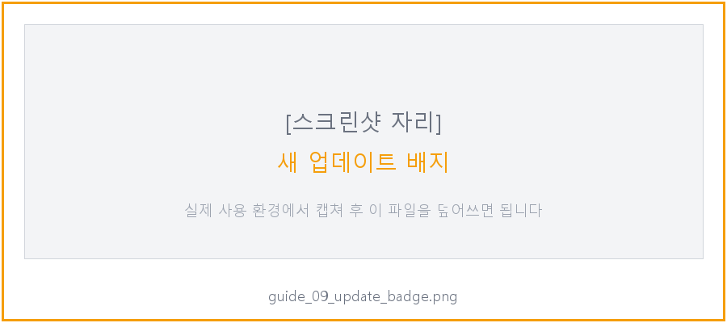
<figcaption>[스크린샷 자리] 상단 우측 "📥 새 업데이트" 노란 배지 (깜빡임) — 클릭하면 모달 열림</figcaption>
</figure>

**해야 할 것**:
1. 배지 클릭 → 업데이트 모달 열림
2. 현재 버전과 원격 버전 SHA + 커밋 메시지 표시됨
3. **[지금 업데이트]** 클릭
4. 완료되면 "✓ 업데이트 완료 — 프로그램을 재시작하세요" 메시지
5. 브라우저 창 닫고 → CMD 창 닫고 → 바탕화면 **`NCR RPA`** 다시 더블클릭

<figure>
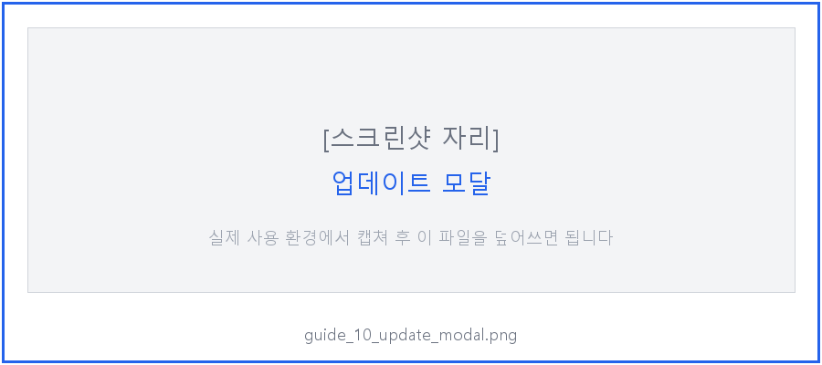
<figcaption>[스크린샷 자리] 업데이트 모달 — 커밋 SHA 와 변경사항 메시지 확인 후 [지금 업데이트]</figcaption>
</figure>

### 3-2. 배지가 안 뜰 때

노란 배지는 **새 버전이 있을 때만** 뜹니다. 안 보이면 최신입니다. 수동 확인하려면:
- 상단 **⚙ 설정** 열기 → 하단 설정 패널에서 "업데이트 다시 확인" (해당 버튼이 없으면 CMD 창에서 `python update.py --check`)

### 3-3. 업데이트가 실패했을 때

- `backup_before_<SHA>/` 폴더에 **자동 백업** → **자동 복원** 됨 → 원래 버전으로 계속 사용 가능
- 네트워크 오류일 수 있으니 잠시 후 재시도
- 계속 실패하면 IT 담당자(안예준) 에게 로그 (`logs/` 안 최신 .log 파일) 전달

---

## 4부. 자주 나오는 문제와 해결

### 4-1. "ERP 창을 찾을 수 없습니다"

**원인**: UNIERP 가 안 떠있거나, 관리자 권한 차이

**해결**:
1. UNIERP 를 **관리자 권한** 으로 다시 시작 (우클릭 → 관리자로 실행)
2. 로그인
3. 대시보드 **[🔍 ERP 창 확인]** 다시 클릭

### 4-2. "Tab 순서가 어긋남" (엉뚱한 필드에 값이 들어감)

**원인**: UNIERP 폼 레이아웃이 변경되거나 disabled 된 필드가 바뀜

**해결**: IT 담당자에게 문의. `config/forms/_defaults/부적합판정등록.json` 수정 필요.

### 4-3. 입력 도중 중단됨 — "다른 창이 활성화되어 입력을 중지했습니다"

**원인**: 입력 중 다른 창 클릭하거나 알림창이 뜸

**해결**:
1. UNIERP 창 최상위 유지
2. 대시보드 **[▶ 입력 시작]** 재클릭 → 중단된 보고는 `PENDING` 복원됐으므로 재조회 하면 다시 뜸

### 4-4. "라디오 값(예/아니오)이 잘못 선택됨"

**원인**: `claim_status` / `corrective_action_status` DB 값이 "예"/"Y"/"true" 외의 형태

**해결**: 웹 QC 페이지에서 해당 보고의 값을 확인 → "예" 또는 "아니오" 로 정확히 저장되도록 QC 담당자에게 요청

### 4-5. 큐에 보고가 아예 안 뜸

**원인**:
- 모든 보고가 QC 승인 안 됨 (`qc_status != APPROVED`)
- 최근에 실패해서 재시도 대기 중 (`sync_next_retry_at` 이 미래)

**해결**: QC 담당자가 승인 완료했는지 확인. 그래도 안 뜨면 큐 테이블의 **재시도 열(↻ N)** 확인 → 숫자 있으면 백오프 중 (최대 60분 대기).

### 4-6. 실패한 보고가 반복 재시도 됨

5회까지 자동 재시도 (지수 백오프 2분 → 4 → 8 → 16 → 32분). 5회 지나면 `FAILED` 로 확정되고 더 이상 재시도 안 됨. IT 담당자가 Replit 웹에서 수동으로 상태 복원 가능.

### 4-7. 시작.bat 실행하니 깨진 글씨 + 명령 오류 다발

**원인**: 시작.bat 의 유니코드 특수문자(→, —) 가 코드페이지와 안 맞음

**해결**: GitHub 에서 최신 시작.bat 하나 다운로드해 교체:
```
https://github.com/Zel-da/Code-Transformer/raw/main/rpa-ncr/시작.bat
```

---

## 5부. 체크리스트

### 처음 설치 (최초 1회)
- [ ] Python 3.11 또는 3.12 설치 (3.13 금지)
- [ ] `Code-Transformer-main.zip` 다운로드
- [ ] `rpa-ncr/` 폴더만 `Documents\` 아래로 이동
- [ ] IT 담당자에게 `PRIVATE/app_db.json` 받아서 `PRIVATE/` 안에 넣기
- [ ] `바탕화면에 바로가기 만들기.bat` 더블클릭 → 바탕화면 아이콘 생성
- [ ] 시작.bat 처음 실행 → 자동 설치 (2~3분)
- [ ] 브라우저 자동 열림 → 상단 chip 전부 확인

### 매일 사용
- [ ] UNIERP 를 관리자 권한으로 실행 + 로그인
- [ ] 바탕화면 **NCR RPA** 더블클릭 → UAC [예]
- [ ] 상단 chip 확인: `소스: DB` + `ERP 연결됨`
- [ ] **[📥 PENDING 조회]** → 큐에 보고 뜨는지 확인
- [ ] **[🔍 ERP 창 확인]** → ERP 연결됨 확인
- [ ] **[▶ 입력 시작]** → UNIERP 자동 입력 지켜보기 (마우스/키보드 X)
- [ ] 배치 검토 패널에서 각 보고 눈으로 확인 → **[이 보고 완료]** 또는 **[모두 확인]**
- [ ] 큐 전부 **완료** (초록 pill) 되면 끝

### 주 1회
- [ ] 상단에 노란 **새 업데이트** 배지 있는지 확인 → 있으면 모달 → **[지금 업데이트]** → 재시작

---

## 부록: 도움 필요할 때 연락

| 상황 | 연락 |
|---|---|
| 프로그램 오류, 설치 문제 | IT 담당자 (안예준) — yj.an1@soosan.co.kr |
| QC 승인 안 됨, 보고 내용 문제 | QC 담당자 |
| UNIERP 자체 오류 | ERP 운영팀 |

로그는 `Documents\rpa-ncr\logs\` 안 최신 `.log` 파일 — 메일 첨부해서 보내면 분석 가능.
